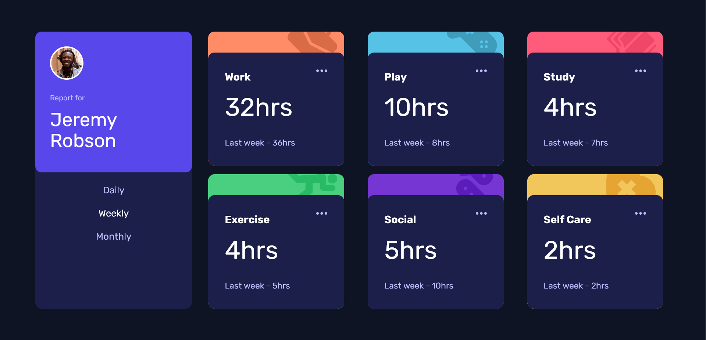

# Frontend Mentor - Time tracking dashboard solution

This is a solution to the [Time tracking dashboard challenge on Frontend Mentor](https://www.frontendmentor.io/challenges/time-tracking-dashboard-UIQ7167Jw). Frontend Mentor challenges help you improve your coding skills by building realistic projects. 

## Overview

### Screenshot

### Links

- Solution URL: [Github](https://github.com/siyam-eng/four-card-feature-component)
- Live Site URL: [Website](https://siyam-eng.github.io/four-card-feature-component)

## My process

### Built with

- Semantic HTML5 markup
- Tailwind CSs
- CSS Grid
- JS

### What I learned
Learned to fetch data from an API using the fetch() function of JS. Moreover, improved my tailwind skills too.  
## Author

- Website - [Siyam Ahmed](https://siyamahmed.com)
- Frontend Mentor - [@Siyam1888](https://www.frontendmentor.io/profile/Siyam1888)
- Twitter - [@siyam_88](https://www.twitter.com/siyam_88)
